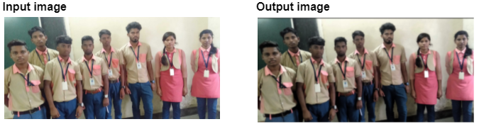
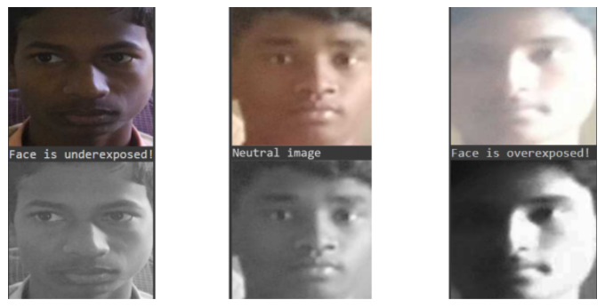
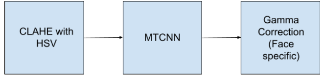

#What is DATA PRE- PROCESSING ?

The data that we receive might not always be in the best form to feed in to the model. Hence to just manipulate the data to the form we can use effectively, we perform data preprocessing.

 
#Why do we need it ?

Two things play a very important role in the face recognition pipeline. The first being the pose and second is the lighting conditions (illumination).

Problem identified in the dataset given to us: The images had different lighting conditions. When the pipeline would be deployed, we still have no control over the illumination. Hence we need to pre process our data so that all of the images would come to a common lighting condition.
The techniques we tried for achieving the same are:
Histogram equalizer
Adaptive Histogram equalizer (CLAHE) for grayscale images
CLAHE - by extracting each of the channels and equalising each channel
CLAHE - by equalising the ‘V’ channel of the HSV form of the image.
Logarithmic transform
Gamma Correction 
Image specific Gamma Correction

 
#Concepts Explored
 
##1. Histogram Equalizer 

Histogram Equalization is a technique used to improve the contrast in images. The regions of lower contrast are improved to a higher contrast. The main objective of Histogram equalizer is to normalise the varying illumination conditions. 
Histogram Equalization can be applied to the whole image by equalizing the individual channels or by converting the image to another colour space.

Adaptive Histogram Equalizer or CLAHE is used to equalize the image at every section. We can set a particular clip limit value according to which the image will be normalized.

For this dataset we have used CLAHE by equalizing the ‘V’ channel of the HSV form of the image. Converting to HSV and then equalising gave the best results as compared to grayscale or RGB.

##2. Gamma Correction

Gamma correction is used to improve the contrast of an image based on its current lighting conditions, which implies that for each image we can apply a different value of gamma and normalize it. 

We classified the images into three categories based on the illumination
Overexposed : Images with very bright lighting condition
Underexposed : Images with dark lighting condition
Neutral : Images with a good lighting
  
Based on this classification we used different values of gamma to correct the images.
We classified the images based on the bright and dark thresholds and applied the gamma values as 2 for underexposed images and 0.3 for overexposed images. No gamma correction was done for neutral images. 

#Concluding Remarks

For better results we have used the following pipeline for preprocessing:

 
#References
[refer](https://medium.com/@fanzongshaoxing/detect-face-in-bad-lighting-condition-using-color-histograms-2571df5fc53b
)
 
 
 
##----TABLE OF CONTENT----
1. [Home](index.md) 
2. [Overview](overview.md)     
3. [Introduction](introduction.md)    
4. [Data-pre-processing](data-pre-processing.md)   
5. [Face-Detection](face-detection.md)   
6. [Face-Alignment](face-alignment.md)    
7. [Face-Recognition](face-recognition.md)   
8. [Face-Verification](face-verification.md) 

