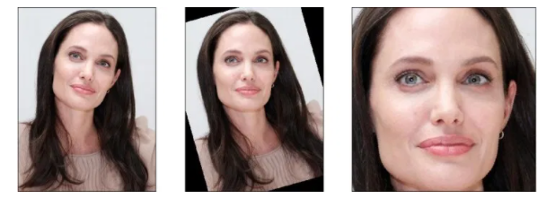
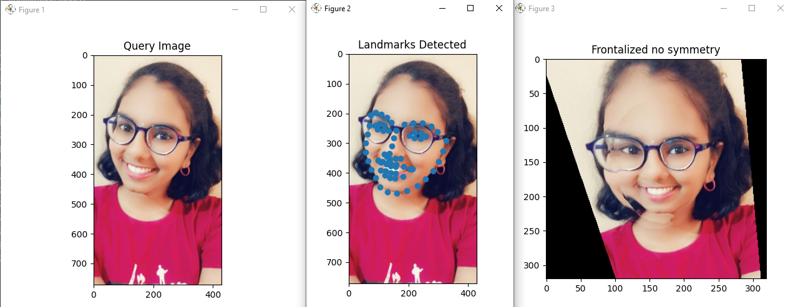

#What is Face Alignment

Face alignment is the process of identifying the geometric structure of different faces in digital images. We attempt to obtain a canonical alignment of the face based on translation, scaling, and rotation. There are many ways to perform face alignment. Some methods try to impose a (pre-defined) 3D model and then apply a transform to the input image such that the landmarks on the input face match the landmarks on the 3D model. Face alignment can be seen as a form of “data normalization”. Just as we normalize a set of feature vectors via zero centering or scaling to unit norm, prior to training any model, we align the faces in our dataset before forwarding them in the pipeline. This process ensures higher accuracy from the face recognition models.

#Why do we need it

We will be dealing with group images in this project. When a group image is captured it may includes positioning of several people in different angles, trying to face the camera with some degree of rotation in the face and other facial landmarks. In this case, there will be a loss in accuracy of the output due to these unnecessary rotations. So, we need to normalize these rotations in order to obtain better results when we move forward in the pipeline. 

#Concepts Explored
##1. Face Alignment

Face alignment is an early stage of the modern face recognition pipeline. Google declared that face alignment increases the accuracy of its face recognition model FaceNet from 98.87% to 99.63%. This is almost 1% accuracy improvement. Similar to face detection which is also the earlier stage of the pipeline, we can apply 2D face alignment within OpenCV in Python easily.

##2. Frontalization

“Frontalization” is the process of synthesizing frontal facing views of faces appearing in single unconstrained photos. Recent reports have suggested that this process may substantially boost the performance of face recognition systems. This, by transforming the challenging problem of recognizing faces viewed from unconstrained viewpoints to the easier problem of recognizing faces in constrained, forward facing poses. Previous frontalization methods did this by attempting to approximate 3D facial shapes for each query image. But here its observed that 3D face shape estimation from unconstrained photos may be a harder problem than frontalization and can potentially introduce facial misalignments. Instead, the simpler approach of using a single, unmodified, 3D surface as an approximation to the shape of all input faces is preferred. This leads to a straightforward, efficient and easy to implement method for frontalization. More importantly, it produces aesthetic new frontal views and is surprisingly effective when used for face recognition and gender estimation.

##Difference between the two
#Concluding Remarks
#References
##----TABLE OF CONTENT----
1. [Home](index.md) 
2. [Overview](overview.md)     
3. [Introduction](introduction.md)    
4. [Data-pre-processing](data-pre-processing.md)   
5. [Face-Detection](face-detection.md)   
6. [Face-Alignment](face-alignment.md)    
7. [Face-Recognition](face-recognition.md)   
8. [Face-Verification](face-verification.md) 