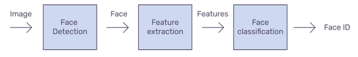

#Face Detection

In this step we will detect the faces in the given image. There are several models that perform this. Some of them we explored are. 
1. OpenCV Haarcascade 
2. Keras - CNN (Convolutional Neural Network) 
3. Face Recognition using Dlib 
4. MTCNN in Python 

#OpenCV Haarcascade

It is a machine learning based approach where a cascade function is trained from a lot of positive and negative images. Then, it can be used on any image we want to detect faces in. It is well known for being able to detect faces and face parts in an image, but can be trained to detect a vast majority of objects.

#MTCNN in Python

MTCNN or Multi-Task Cascaded Convolutional Neural Network is unquestionably one of the most popular and most accurate face detection tools today. As such, it is based on a Deep learning architecture, it specifically consists of 3 neural networks (P-Net, R-Net, and O-Net) connected in a cascade.

#Concluding Remarks 

Out of these we used detecting faces with Facenet. Because it is very effective at detecting faces correctly. From facenet_pytorch we imported mtcnn and we used it to detect faces. After preprocessing the image we sent that image to mtcnn to detect the faces. After detecting the faces we are sending those faces for a feature extraction model to get embeddings.

 

 
 
 
 
##----TABLE OF CONTENT----
1. [Overview](overview.md)         
3. [Data-pre-processing](data-pre-processing.md)   
4. [Face-Detection](face-detection.md)   
5. [Face-Alignment](face-alignment.md)    
6. [Face-Recognition](face-recognition.md)   
7. [Face-Verification](face-verification.md)   
2. [Conclusion](introduction.md)
