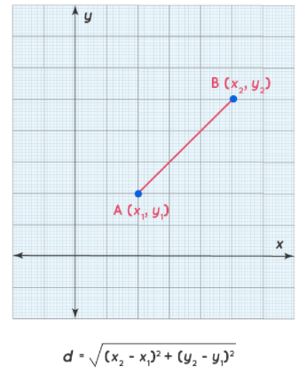
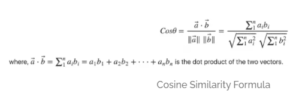

#Face classification

In this step with the help of embeddings we are identifying the person in the image. There are many classification algorithms like SVC,Logistic regression,KNN etc. We are using SVC,
cosine similarity and euclidean distance approach for classifying. In cosine similarity we will
find the cosine angle between two vectors. If the angle is less then the two images are the
same. In the euclidean approach we are finding the euclidean distance between two vectors.
If the distance is less then the both images are the same.

#SVM

Support Vector Machine” (SVM) is a supervised machine learning algorithm that can be used for both classification or regression challenges. However,  it is mostly used in classification, where it classifies data into different classes. In the SVM algorithm, we plot each data item as a point in n-dimensional space (where n is a number of features we have) with the value of each feature being the value of a particular coordinate. Then, we perform classification by finding the hyper-plane that differentiates the two classes very well.

###Support Vector Machines Applied to Face Recognition

A SVM algorithm generates a decision surface separating the two classes. For face recognition, we re-interpret the decision surface to produce a similarity metric between two facial images. This constructs face-recognition algorithms.

#EUCLEDIAN Distance

Euclidean Distance represents the shortest distance between two points(or) the straight line distance.To find the two points on a plane, the length of a segment connecting the two points is measured. We derive the Euclidean distance formula using the Pythagoras theorem.
Let us assume that (x1,y1) and (x2,y2) are two points in a two-dimensional plane. Here is the Euclidean distance formula, where 'd' is the distane:-

#COSINE Similarity

Cosine similarity is a metric used to measure how similar the documents are irrespective of their size. Mathematically, it measures the cosine of the angle between two vectors projected in a multi-dimensional space. The cosine similarity is advantageous because even if the two similar documents are far apart by the Euclidean distance (due to the size of the document), chances are they may still be oriented closer together. The smaller the angle, higher the cosine similarity.

##----TABLE OF CONTENT----
1. [Overview](overview.md)         
3. [Data-pre-processing](data-pre-processing.md)   
4. [Face-Detection](face-detection.md)   
5. [Face-Alignment](face-alignment.md)    
6. [Face-Recognition](face-recognition.md)   
7. [Face-Verification](face-verification.md)   
2. [Conclusion](introduction.md)