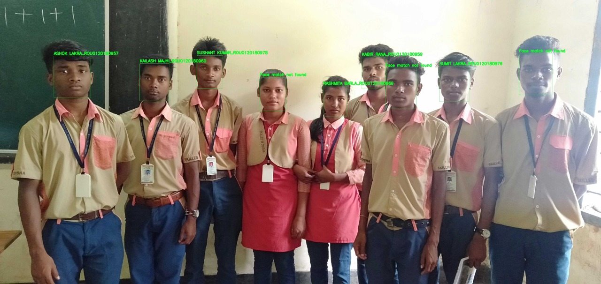
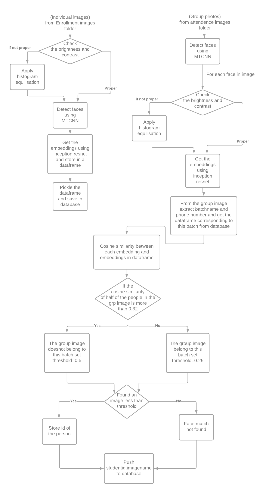

#Output Image

#Flow Chart

#Conclusion

Hereby we conclude that marking attendance using Facial Recognition model is a smatter way of doing it, as it is more user friendly as well as accurate.

#Contributors

1. Meda Sai Balaji Bhargav 
2. Kodumuru Saketh 
3. Phani Tulasi Batchu 
4. Solipuram Akshith Reddy 
5. Pendyala Sri Harshita 

##----TABLE OF CONTENT----
1. [Home](index.md) 
2. [Overview](overview.md)     
4. [Data-pre-processing](data-pre-processing.md)   
5. [Face-Detection](face-detection.md)   
6. [Face-Alignment](face-alignment.md)    
7. [Face-Recognition](face-recognition.md)   
8. [Face-Verification](face-verification.md)  
9. [Conclusion](introduction.md)    
